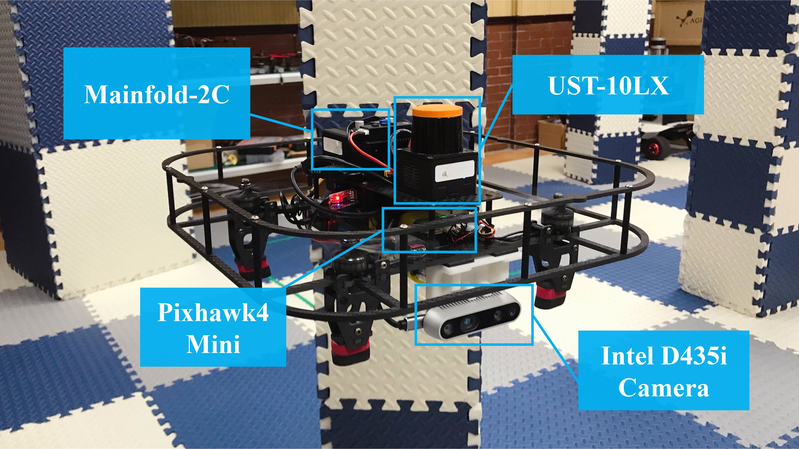
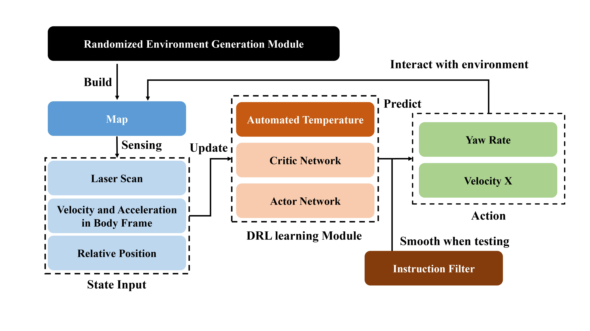

# Multi-Rotor Obstacle Avoidance : Reinfocement Learning 4.0.0

## An DRL-based path planning framework for real quadrotor

 



[video](https://space.bilibili.com/35680677?spm_id_from=333.1007.0.0)

## Latest Update
1. complete paper
2. improve documentation

### **1. feature**

| interface | version |
| --------- | ------- |
| ubuntu    | 18.04   |
| ros       | melodic |
| pytorch   | 1.4.0   |


### **2. installation**


**ROS melodic**

refer to [here](http://wiki.ros.org/Installation/Ubuntu)

**Gazebo 9**

```
sudo apt install ros-melodic-gazebo-*
```

download [models.zip](https://lark-assets-prod-aliyun.oss-cn-hangzhou.aliyuncs.com/yuque/0/2021/zip/985678/1614564736994-3ac600e4-75fc-44ef-9cf5-3f1c3f0c8679.zip?OSSAccessKeyId=LTAI4GGhPJmQ4HWCmhDAn4F5&Expires=1642594102&Signature=Gh7XDBHBCv6GiHHxj1R6Oisrxfc%3D&response-content-disposition=attachment%3Bfilename*%3DUTF-8%27%27models.zip) and unpack under `~/.gazebo/`.

**Mavros**

```
sudo apt install ros-melodic-mavros ros-melodic-mavros-extras
wget https://gitee.com/robin_shaun/XTDrone/raw/master/sitl_config/mavros/install_geographiclib_datasets.sh
sudo chmod a+x ./install_geographiclib_datasets.sh
sudo ./install_geographiclib_datasets.sh
```

**PX4**

```
git clone https://github.com/PX4/PX4-Autopilot.git
mv PX4-Autopilot PX4_Firmware
cd PX4_Firmware
git checkout -b xtdrone/dev v1.11.0-beta1
git submodule update --init --recursive
make px4_sitl_default gazebo
```

open `~/.bashrc`, and insert

```
source ~/catkin_ws/devel/setup.bash
source ~/PX4_Firmware/Tools/setup_gazebo.bash ~/PX4_Firmware/ ~/PX4_Firmware/build/px4_sitl_default
export ROS_PACKAGE_PATH=$ROS_PACKAGE_PATH:~/PX4_Firmware
export ROS_PACKAGE_PATH=$ROS_PACKAGE_PATH:~/PX4_Firmware/Tools/sitl_gazebo
```

**QGroundControl**

refer to [here](https://docs.qgroundcontrol.com/master/en/getting_started/download_and_install.html)

**Anaconda**

refer to [here](https://www.anaconda.com/)

**virtual environment**

create env

```
conda create -n my_env python=2.7
conda activate my_env
```

update pip
```
pip install --upgrade pip
```

install dependence

```
pip install requirements.txt
```

**Building pkg**

create workspace

```
mkdir catkin_ws
cd catkin_ws
mkdir src
cd src
catkin_init_workspace
```

Download this project and put it into `src`.

```
cd ..
catkin_make
```

copy models `falco`/`imu_gazebo`/`UST_10LX` to `~/PX4_Firmware/Tools/sitl_gazebo/models`.

**Run Samples**

```
# open gazebo
roslaunch multi_rotor_avoidance_rl setup_env.launch
```

open `QGroundControl` load `models/falco/params/sim.param`.

```
# start task
rosrun multi_rotor_avoidance_rl training_node.py	
# rosrun multi_rotor_avoidance_rl testing_node.py
```


